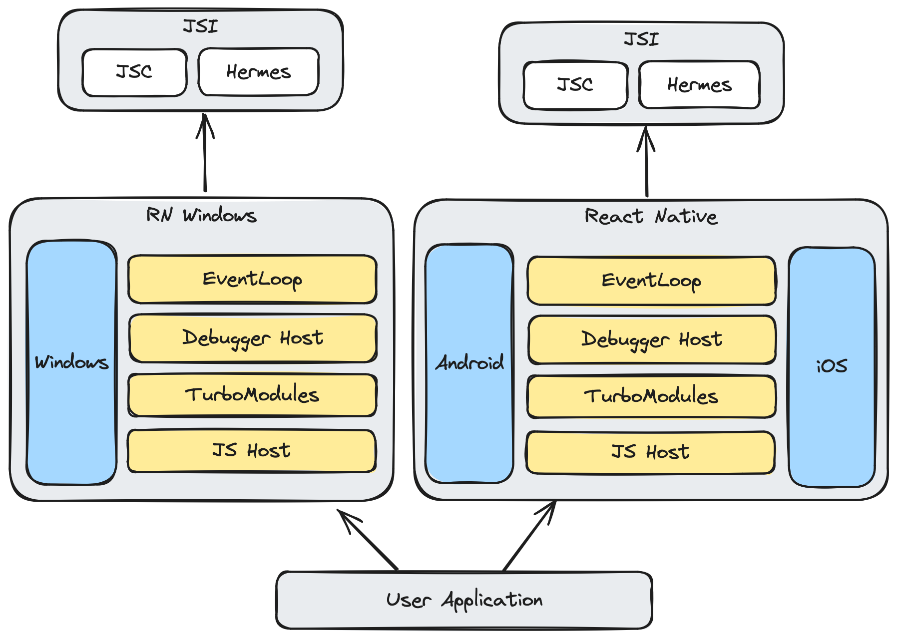
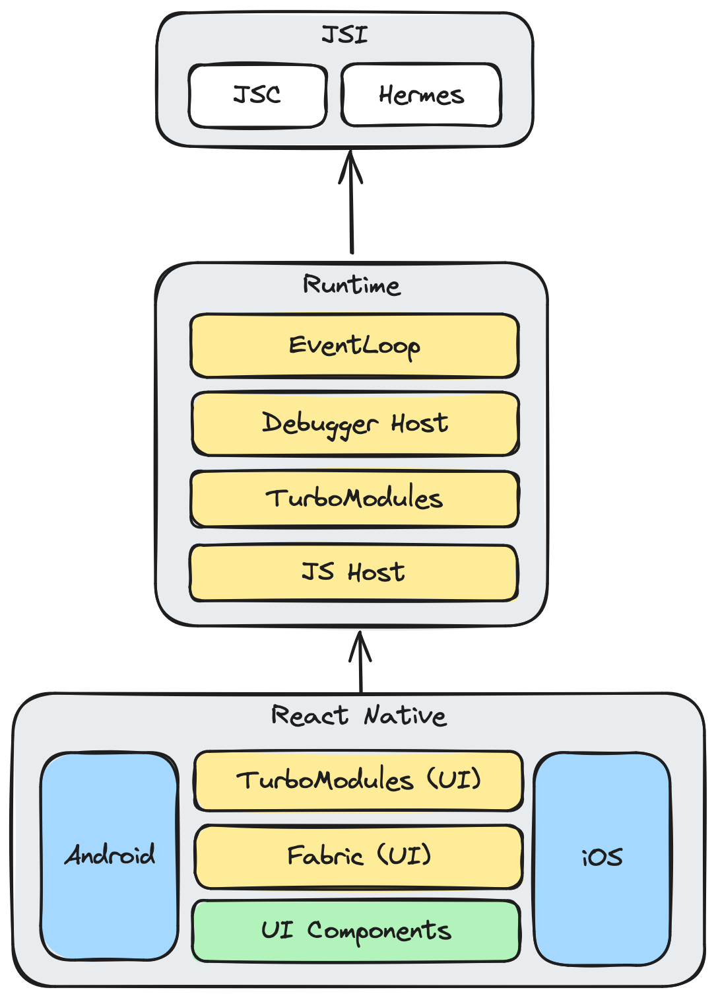
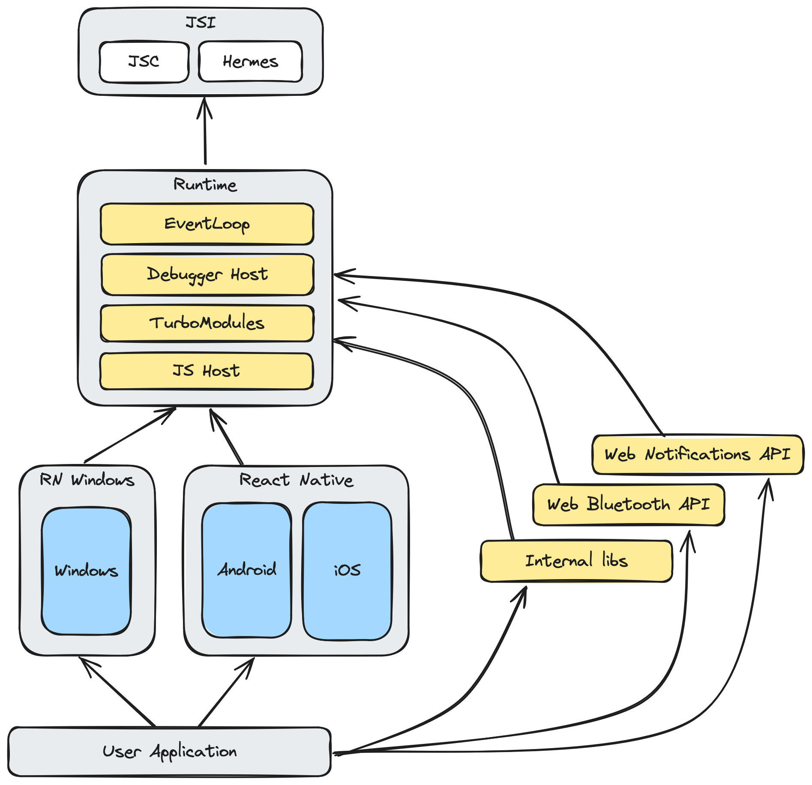
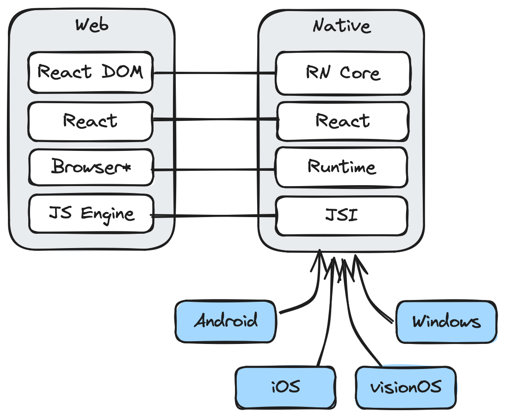

> **NOTE**: This is an early draft of the RFC. As it affects most of the RN, it is intended to
> be a bit more generic and to collect feedback and collectively build a good adoption strategy and detailed approach. 

# RFC0000: Extraction of Runtime layer

## Summary

Main goal of this RFC is to extract a new layer in React Native stack from already existing, shared code, 
that lives between `jsi` and React Native, reducing redundancy.

Shortly, the goals are:

 - Extract the React Native non-ui logic into separate package/layer
 - Keep compatibility with existing code as much as possible
 - Make long term maintenance, versioning and updating easier
 - Make React Native more inclusive towards OOT (out of tree) platforms
 - Allow faster iterations on headless APIs compatibility (e.g. Web)

> OOT (out of tree platforms) refer to platforms that are not part of the main repo.

## Motivation


By splitting the current project into smaller pieces, with explicit API boundaries,
we should be able to simplify the maintenance and testing in the long run. This, 
of course would require us to specify a "stable" interface to work with. This probably 
won't be achieved easily and promptly, but is a good long term goal to try to achieve.

Understanding the current dependencies and boundaries is also quite problematic and raises 
the entry barrier to contributing to the React Native project.

Right now, updating the React Native projects is a long and troubling process.
This is (non exclusively) caused by the fact that the scope of changes between version goes 
across many API surfaces. Having the (limited) possibility to update the runtime version 
in a project independently of UI would make it more approachable by reducing the all-or-nothing 
upgrading pattern.

Additionally, there are quite a few missing pieces in the current ecosystem, that from what I know, 
are hard to add for different reasons, such as `i18n`, `subtleCrypto` among others. There is also 
an ongoing effort to increase the compatibility with web environments by bringing the 
[WebAPIs to the React Native](https://github.com/microsoft/rnx-kit/pull/2504). 

Having a package that can iterate separately, working on adding missing features
independently of React Native UI layer would make bringing the support faster.
Currently, React Native tightly couples its feature and UI code, making them non-separable. 
Given that React Native plans on integrating more closely with WebAPIs (or a subset), this
coupling makes it hard to work on these APIs as well as test them, slowing down the development speed,
as we need to create a UI to even be able to test them, or otherwise is very hard to do (as it seems
to not be a supported development path).

It should be possible to alter or swap some parts of React Native without creating and maintaining
a fork or a long list of internal patches. A plug-and-play architecture is a sign of good design,
allows greater modularity, and facilities separation of concerns and decoupling.

### Goals

**The main goal is to make it possible for end-users, by altering build and runtime configuration,
to create perfectly fit runtime variant they need for the application.**

> __NOTE__: In this context we are talking about headless APIs, not related to UI.

To do this, we should have an extensible layer, that can be built upon and configured, just like LEGO blocks. 

For example, if the project is in need for the i18n API, and they are ready to accept the 
drawbacks of increased app binary and increased app startup time, it should be easily doable, 
without forking the React Native. The same can be said about other APIs, such as `crypto`, 
where they might want to use our provided solution, not use it at all, or use in-house closed 
source solution.

The same can be said about changing the JS engine. The proposed layer would take care of allowing user
to use another engine by using the already existing `jsi` interface. JS engine should be treated
like a building block similar to others that can be changed easily by build time configuration.

Right now, we have something similar already: the C++-only TurboModules, which are kind of tightly coupled 
with the rest of the React Native and the distinction can be a bit confusing for newcomers.

Such blocks would have access to Event Loop and JS engine, so new globals can be added in as-needed
basis.

Taking WebAPIs as an example, having their implementations split across multiple different TurboModules,
we can release and version them independently further simplifying update process.
In case the `react-natime-runtime` changes in a breaking manner, we can tightly couple the versions
of such TurboModules or make them part of `react-native-runtime` that are extracted later, when
the breaking changes become less frequent.

__Secondary goal is to be able to develop and test those headless modules easily, on the CI pipeline without visual environment__.

By having the possibility to run the "blocks" (C++ only turbo modules) in a headless JS environment we
are able to test the implementations easily on many CI platforms and on different JS engines (ideally).

A side effect of this is we can perhaps achieve faster build times both on CI and locally, resulting in lower cost of such pipelines.

__Tertiary goal is to bring OOT (out of tree) platforms closer to first-class citizens__

If a Turbo Module does not need access to UI in any way to provide its features, having it work with `react-native-runtime`
rather than `react-native` would make it easier to maintain for currently OOT platforms (such as rn-windows and rn-mac) where
the current `react-native` code cannot be re-used in 100% (needs further clarification). 
Right now we are biased towards mobile platforms only.

### Non-goals

This RFC does **not** aim to:

 - Replace or deprecate proposal [Move iOS and Android Specific Code to Their Own Packages](https://github.com/react-native-community/discussions-and-proposals/pull/49)

## Detailed design

> **NOTE**: Because we are talking about headless code, TurboModules refer to C++ only TurboModules unless
> otherwise noted.

### Overview

Before proceeding to the description of the suggested changes, let's consider an example of a React Native application 
with additional OOT platform can be represented in current state (more or less):



The proposed `react-native-runtime` layer would be everything from React Native that is
independent of the UI layer (so essentially everything headless) with enough extension points and mount
points to make it elastic enough to be extended by UI layer or platform layer, if needed.

This includes, but is not limited to:

 - Event Loop
 - JS engine management
 - C++-only Turbo Module hosting

And ideally, in the future (out of scope for this RFC):
 - DevTools interface and debugging host (long term, after the interface gets stabilized)
 - Handling of Shared and Dedicated Workers

`react-native` would then focus mostly on:

  - Shadow Nodes
  - Rendering
  - UI TurboModules (?)

The parts of the React Native that are not stable enough or are just being tested out
can be kept in `react-native` package until becoming more stable, with less frequent breaking changes
and then moved to `react-native-runtime` with more stable interface.

---

Having a runtime layer extract some of the pieces to shared layer:



Now, with React Native layer focusing solely on UI layer, having an additional OOT platform would make the former diagram 
look more like the following (with additional APIs the user decided to add):



The new layer would take care of `jsi` interface surface and let React Native (core/UI)
focus on working with UI and executing the user code, no matter the engine is currently selected.

At the heart of `react-native-runtime` would be the event-loop and JS interface, on which other building blocks 
would be based on.

This would, for example, allow community to implement custom storage solution using `localStorage` API,
ideally matching the DOM spec. By having the DevTools Interface as part of this package, they can also
hook up into `Storage` tab from `Dev tools` to provide excellent Developer Experience.

While the `react-native-runtime` would need to maintain those generic interfaces, the React Native community
can contribute with implementations of such interfaces (JS, EventLoop and DevTools).

The same can be done with e.g. networking, where C++-modules would be able to hook up to `Networking`
tab to report and display network requests to provide the best DX possible. This would greatly benefit
brownfield applications where most of the code is still native.

### Building tools

The Runtime and its turbo modules could be built using CMake only, as they are all written in C++,
leaving room for React Native or perhaps even React Native Frameworks to use any other build tool that
is in any way compatible with CMake.

For example, an example application project graph may look like following:

```
my-rn-app
├── react-native-runtime
│   ├── lib-rnrt-fetch
│   ├── lib-rnrt-crypto
│   ├── lib-rnrt-mmkv
│   │   ├── android
│   │   ├── ios
│   │   └── windows
│   └── libhermes
├── react-native
│   ├── react-native-gesture-handler
│   ├── react-native-maps
...
```

Integration with another languages can be achieved by leveraging C++ API or creating a C API compatible
API subset. It is, however, out of scope for this RFC.

### Runtime Composability

The goal of runtime composability is to essentially provide the features you need without paying for
ones you do not use.

This can be achieved by updating the process of how TurboModules are discovered and handled at build time level.
Considering these TurboModules aim to expose new APIs to the JS world, we could make them conditionally linked
(either statically or dynamically).

There are two approaches we can further discover:

 - Leveraging dynamic library constructor and destructor functions (`attribute(constructor)`/`attribute(destructor)`)
   
   This can be hard to do right, but ideally would be build-time only without any changes required in code or at runtime.
   Unfortunately this only work with dynamic libraries, so we would require all modules to be linked dynamically which is suboptimal.
  
 - Exposing a Well known function that registers itself in React Native runtime 
   
   Similar to what we are doing now with TurboModules, we expect the library to export a function that we call in order to 
   augment to runtime. This is probably more compatible solution but also requires having a collection of expected 
   modules in code in order to load them.

Application develop should be able to decide which of the libraries should be linked. React Native would then
depend on the built runtime library. Both static linking and dynamic linking should be supported.

### Per-Platform implementation

Suggested approach still allows developers to have runtime level TurboModules use platform specific code
by linking different libraries depending on the target platform.

Leveraging the "take what you need only" approach allows to tailor the final application bundle just as needed
for each platform. This, however requires additional work from the build tool.

An example of such library that requires per-platform implementation and also is UI independent is `react-native-mmkv`.
It implements a generic, headless API that hooks up to correct storage depending on the platform.

A potential approach for per-platform implementation is to split the libraries and user C++ interop:

```
├── lib-rnrt-mmkv-core
├── lib-rnrt-mmkv-android (JNI)
```

This can result in (subjectively healthy) distinction of platform specific code that either depends on UI or not.
Consider Android and iOS platforms being split into:

 - Android
   - `lib-android`
   - `lib-android-ui`
 - iOS
    - `lib-ios` (or perhaps `lib-apple`, as this is UI independent)
    - `lib-ios-ui`

This would benefit OOT platforms where only UI needs to be changed. 

### Faster iterations & versioning

Having `react-native-runtime` and `react-native` being versioned and released independently allows for simpler updating in
cases when both are compatible. It might not happen shortly after transition, but when the interfaces
exposed from the `runtime` become mature enough, this should be easily doable.

For example, consider a mobile application that needs a feature added in new `react-native-runtime` release,
which added support for `navigator.clipboard` API.

Considering we reached the point the interface is mostly stable, the `react-native-runtime` version can be updated
without impacting `react-native` library.

This also makes the updating process easier.

For matching the `react-native-runtime` and `react-native` versions, we could use:

 - peer dependency in `react-native-core`
 - `package.json` `engine` field

### Codegen

Because the TurboModule bridging would live in `react-native-runtime`, the codegen would need to be updated.

### Old architecture

As Old architecture is deprecated in favor of new architecture. The bridge can be kept in `react-native`
for transition period.

### Transition period

There are several approaches we can perform to allow transitioning to new approach:

#### C++ Code

For transition period, we can re-export the symbols from `react-native-runtime` in `react-native` headers.
A new C++ compile-time flag can be added to allow branching in the code depending on whenever the runtime is available or not.

```cpp
#ifdef RN_HAS_RUNTIME
#include <react-native-runtime.h>
#else
#include <react-native.h>
#endif
```

or alternatively using [`__has_include` macro](https://clang.llvm.org/docs/LanguageExtensions.html#has-include):

```cpp
#if __has_include(<react-native-runtime.h>)
#include <react-native-runtime.h>
#endif
```

#### Application code

For end-user applications we can reduce the impact and make `react-native` link the `react-native-runtime` library 
(either statically or dynamically) by default. User could opt out of this feature and then link the runtime
library manually.

This conditional dependency would need to live in both `react-native` and (reversed) in user project during the
transition.

Conditional dependencies are supported by all build systems:

 - [Gradle](https://www.baeldung.com/gradle-conditional-dependencies)
 - CocoaPods

### Potential `react-native-core` extraction

Mentioned as a possibility during Core Contributors Summit 2024, [extracting platforms from `react-native`](https://github.com/react-native-community/discussions-and-proposals/pull/49), and therefore
creating a `react-native-core` layer from would fit perfectly with the suggested approach.

`react-native-core` would then depend on `react-native-runtime` implementing generic UI code, exposing ShadowNode API
allowing other platforms to depend on it.

Such separation of layers would make it more analogous to how React Web is structured right now:



### Allowing more OOT composability

If at any point a new platform needs to make alternations in the runtime it still can
use existing `react-native` package for the UI. The same goes for the inverse if a platform,
for any reason, needs to have its own runtime.

## Drawbacks

 - Extracting and maintaining a public API for the `react-native-runtime` package
 - We have to migrate to this approach affecting external libraries and applications.
 - Potential version incompatibilities between RN-runtime and RN

## Alternatives

None considered that would accomplish the same goals.

## Adoption strategy

For adoption, we can make `react-native` conditionally and by default link `react-native-runtime`. This should be transparent
to `react-native` users. If users want to configure and build their own they can opt out of 
this behavior by disabling a configuration flag. This will require them to own
the `react-native-runtime` dependency.

As already mentioned, we can re-export symbols from `react-native` headers to reduce breaking changes.

This change should be coordinated with external libraries.

This change should be completely transparent for JavaScript code.

## How we teach this

Firstly, we should update the documentation to highlight the strict separation of layers
and the concept of headless, UI-independent runtime.
New documentation section can be added that shows what layer are APIs part of.

We should also document the fact that APIs which are part of the runtime are 
common to all platforms, whenever they are OOT platforms or not.

Perhaps we can use different terminology for C++ TurboModules which would be executed on runtime
and UI TurboModules which would be part of UI layer (`react-native`/`react-native-core`).

What names and terminology work best for these concepts and why? How is this idea best presented? As a continuation of existing React patterns?

As for teaching new React Native developers, we can present our runtime as an equivalent to node-js, which
well known and documented runtime,

## Unresolved questions

 - What should be exactly the ideal API surface for `react-native-runtime` package?
 - What are the requirements and constraints to make proposed solution and improvement for OOT platforms.
 - How should it be versioned?
 - Should be strongly separate TurboModules (C++ only) from UI TurboModules? After extraction,
   they would work on different layers.

## Future opportunities

 - Possible NAPI (Node native API) integration with `react-native-runtime`
 - Because TurboModules would be UI agnostic, we could expose the C API for Turbo Modules, which will make
   us able to write turbo modules using other native languages such Rust, Zig, Go, Swift and any other language that 
   is compatible with C API, which most of them are.
 - We can implement support for `package.json` `engines` field to ensure correct version
   of runtime is used.
 - Separate runtime layer allows for much more possibilities to use React Native, e.g. using NodeJS runtime
   or embedding it into already existing JS runtime (e.g. game engine, browsers, desktop apps)

### Impacted RFCs/ideas

This RFC alters (hopefully in a good way) how can we approach future ideas, such as:

 - Lean Core (2.0)
 - [React Native WebAPI](https://github.com/microsoft/rnx-kit/pull/2504)
 - Better OOT support
 - [RFC0744: Well-defined event loop processing model](https://github.com/react-native-community/discussions-and-proposals/blob/main/proposals/0744-well-defined-event-loop.md)
   
   The event loop would live in the `react-native-runtime` package.    

 - [Move iOS and Android Specific Code to Their Own Packages](https://github.com/react-native-community/discussions-and-proposals/pull/49)

## Changelog

| Date       | Author                                      | Change                    |
|------------|---------------------------------------------|---------------------------|
| 2024-09-07 | [Robert Pasiński](https://github.com/robik) | Initial version published |
